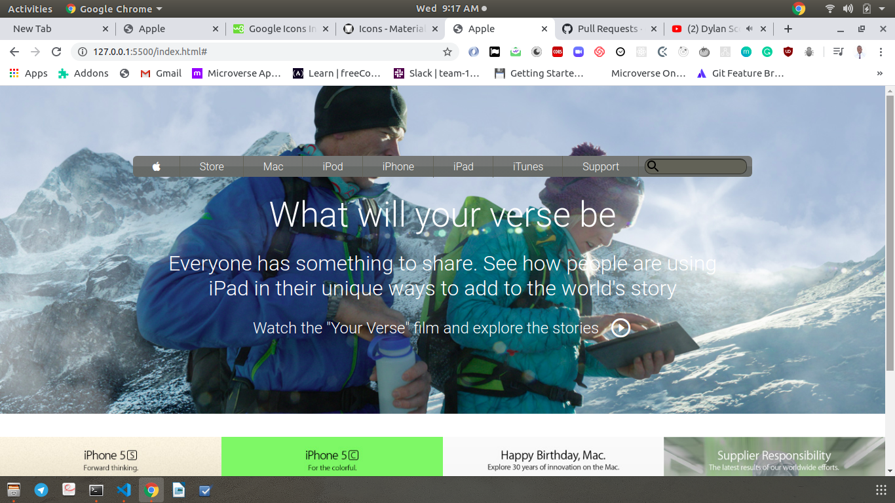

# new-york-times-clone

> this is a clone of the Apple Store". 
> The goal of the project was to learn how to use background images and to position it using background position and background size.
>The layout were achieved using flex box and css grid
> The project is not responsive at the moment 
> We used semantic HTML to structure the markup 



## Built With

- HTML5
- CSS3

## Authors

👤 **Author1**

- Github: [@githubhandle](https://github.com/chirchir12 )
- Twitter: [@twitterhandle](https://twitter.com/shadochir )
- Linkedin: [linkedin](https://www.linkedin.com/in/chirma/ )
- Email: [email](chirchir7370@gmail.com)


## Getting started

- Clone the repository with:
    ``` https://github.com/chirchir12/apple-clone-project.git  ```
- cd to ```apple-clone-project```

- See the original page here: https://web.archive.org/web/20140301004610/http://www.apple.com/

- Check the index.html to edit the structure of the page.

- Check the style.css to edit the style of the page.

## 🤝 Contributing

Contributions, issues and feature requests are welcome!

Feel free to check the [issues page](issues/).

## Show your support

Give a ⭐️ if you like this project!

## Live preview

You can check how the website looks in: https://rawcdn.githack.com/chirchir12/apple-clone-project/954db2912ad11ab81de203d38387b2f4018c052f/index.html
## 📝 License

This project is [MIT](lic.url) licensed.
# new-york-times-clone